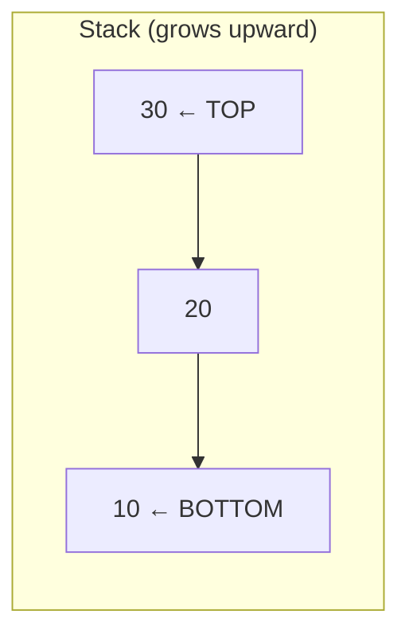
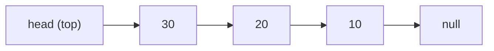
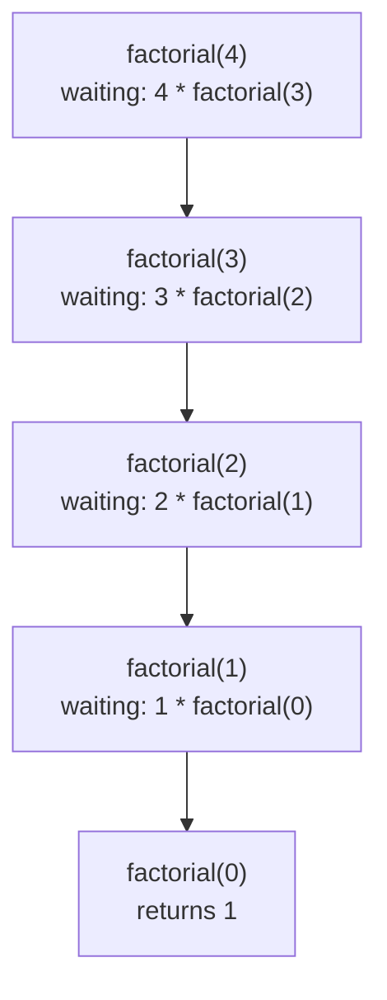
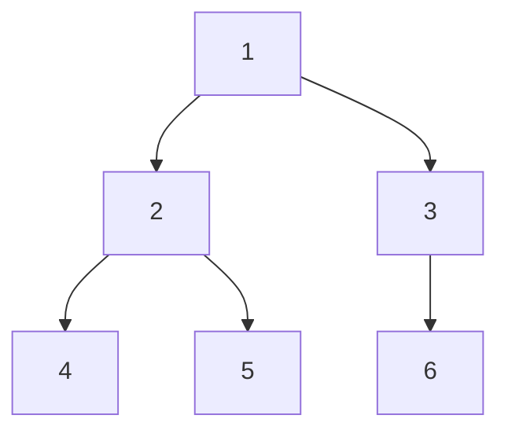
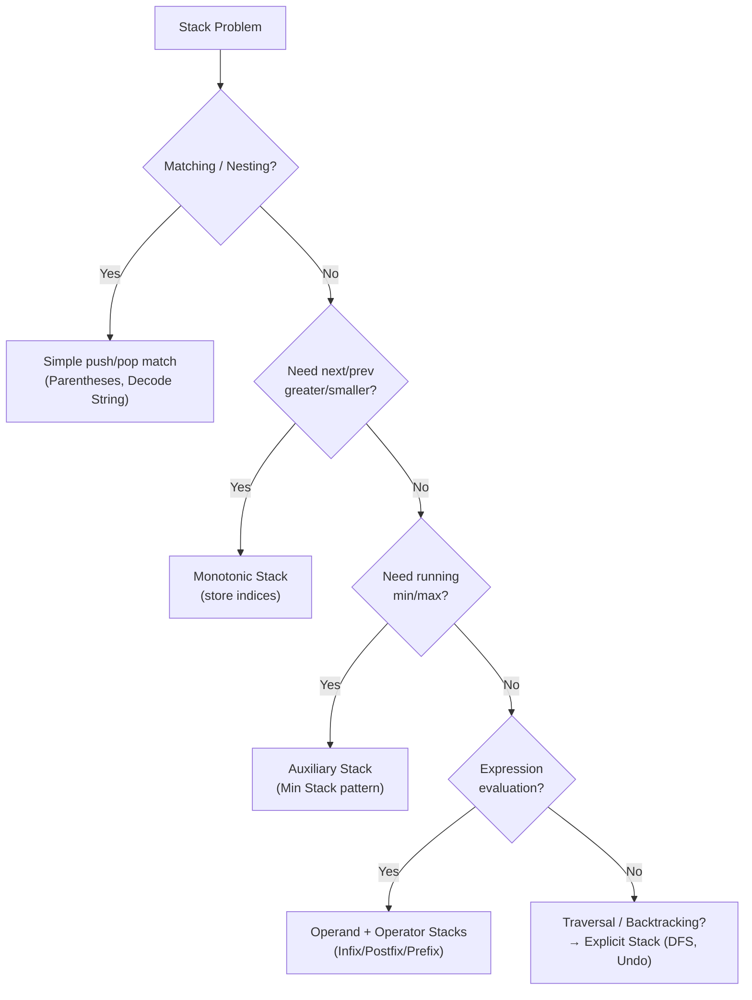

# Stacks — Interview & CP Cheat Sheet
 
---
 
## What Is a Stack?
 
> A **linear data structure** that follows **LIFO** — Last In, First Out.
> The last element pushed is the first element popped.
> Time: `O(1)` for push/pop/peek | Space: `O(n)`
 
---
 
## Core Template (Array-Based Implementation)
 
```java
class Stack {
    int[] arr;
    int top;
    int capacity;
 
    Stack(int size) {
        arr = new int[size];
        capacity = size;
        top = -1;                      // ✅ Empty stack indicator
    }
 
    void push(int x) {
        if (top == capacity - 1) {
            throw new RuntimeException("Stack Overflow");  // ❌ Full
        }
        arr[++top] = x;                // 🔼 Increment then insert
    }
 
    int pop() {
        if (top == -1) {
            throw new RuntimeException("Stack Underflow");  // ❌ Empty
        }
        return arr[top--];             // 🔽 Return then decrement
    }
 
    int peek() {
        if (top == -1) {
            throw new RuntimeException("Stack is Empty");
        }
        return arr[top];               // 👀 Look without removing
    }
 
    boolean isEmpty() {
        return top == -1;
    }
}
```
 
---
 
## Line-by-Line Breakdown
 
| Line | Code | What It Does |
|------|------|--------------|
| 1 | `int top = -1` | Marks stack as **empty** initially |
| 2 | `arr[++top] = x` | Pre-increments `top`, then **inserts** at new position |
| 3 | `return arr[top--]` | Returns **top element**, then decrements pointer |
| 4 | `arr[top]` | **Peek** — reads top element without modifying stack |
| 5 | `top == -1` | Universal check for **empty stack** |
| 6 | `top == capacity - 1` | Check for **full stack** (array-based only) |
 
---
 
## 🧠 Stack Memory Diagrams
 
### Push Sequence: `push(10) → push(20) → push(30)`
 
```
Step 1: push(10)          Step 2: push(20)          Step 3: push(30)
 
Index   Value              Index   Value              Index   Value
  2     [   ]                2     [   ]                2     [30] ← top (top=2)
  1     [   ]                1     [20] ← top (top=1)    1     [20]
  0     [10] ← top (top=0)   0     [10]                  0     [10]
```
 
### Pop Sequence: `pop() → pop()`
 
```
Before pop()               After 1st pop()            After 2nd pop()
 
Index   Value              Index   Value              Index   Value
  2     [30] ← top          2     [ x ]  (removed)      2     [ x ]
  1     [20]                1     [20] ← top (top=1)    1     [ x ]  (removed)
  0     [10]                0     [10]                  0     [10] ← top (top=0)
```
 
### Mental Model
 

 
```text
Think of it like a stack of plates:
  - You can only ADD a plate to the TOP        → push()
  - You can only REMOVE the TOP plate          → pop()
  - You can only LOOK at the TOP plate         → peek()
  - You CANNOT access plates in the middle directly
```
 
---
 
## Using Java's Built-in Stack / Deque
 
```java
import java.util.*;
 
// ✅ Preferred: Deque (faster, no legacy sync overhead)
Deque<Integer> stack = new ArrayDeque<>();
stack.push(10);
stack.push(20);
stack.pop();     // removes 20
stack.peek();    // returns 10
 
// Legacy option (synchronized, slower)
Stack<Integer> legacyStack = new Stack<>();
```
 
---
 
## Why `ArrayDeque` and NOT `Stack` Class?
 
```
❌ java.util.Stack
   → Extends Vector → synchronized → SLOW 🐌
   → Legacy class, not recommended in modern code
 
✅ java.util.ArrayDeque
   → No synchronization overhead → FAST ✅
   → Implements Deque interface → flexible (stack + queue)
```
 
---
 
## Stack Using Linked List
 
> Instead of an array, use **nodes** — push/pop happen at the **head** for `O(1)` with **no resizing needed**.
 
```java
class Node {
    int data;
    Node next;
    Node(int data) { this.data = data; }
}
 
class LinkedListStack {
    Node head;                          // 🔝 head IS the top of the stack
    int size = 0;
 
    void push(int x) {
        Node newNode = new Node(x);
        newNode.next = head;            // 🔗 new node points to old top
        head = newNode;                 // 🔼 new node becomes the top
        size++;
    }
 
    int pop() {
        if (head == null) {
            throw new RuntimeException("Stack Underflow");
        }
        int val = head.data;
        head = head.next;               // 🔽 move top pointer down
        size--;
        return val;
    }
 
    int peek() {
        if (head == null) {
            throw new RuntimeException("Stack is Empty");
        }
        return head.data;
    }
 
    boolean isEmpty() {
        return head == null;
    }
}
```
 
### Visualization
 

 
```text
push(40):
  head → [40] → [30] → [20] → [10] → null
          ↑
        new top
 
pop():
  removes 40, head now points to [30]
  head → [30] → [20] → [10] → null
```
 
---
 
## Array vs Linked List — Which Implementation to Use?
 
| Aspect | Array-Based Stack | Linked-List-Based Stack |
|--------|--------------------|--------------------------|
| Memory | **Contiguous** — cache-friendly | **Scattered** — extra pointer overhead |
| Resizing | Needs resizing (or fixed capacity → overflow risk) | **No resizing** — grows dynamically |
| Push/Pop Time | `O(1)` amortized | `O(1)` always |
| Extra Memory per Element | None | `+1 pointer` per node (`next` reference) |
| Overflow | Possible if fixed-size array is full | **Never** (bounded only by heap memory) |
| Cache Performance | ✅ Better (contiguous memory) | ❌ Worse (pointer chasing) |
| Best For | Known/bounded size, performance-critical code | Unknown size, frequent push/pop, no wasted space |
 
```
🧭 Rule of Thumb:
 
Use ARRAY-based stack  → when max size is known or bounded (competitive programming)
Use LINKED-LIST stack  → when size is unpredictable and memory shouldn't be pre-allocated
Use ArrayDeque (Java)  → in practice, almost always — it's array-based but auto-resizes
```
 
---
 
## Push vs Pop — Pointer Direction
 
| Operation | Pointer Movement | Result |
|-----------|-------------------|--------|
| `push(x)` | `top` moves **up** (increments) | New element added on top |
| `pop()` | `top` moves **down** (decrements) | Top element removed |
| `peek()` | `top` **unchanged** | Just reads top element |
 
---
 
## Termination / Overflow Guarantee
 
Each push/pop changes `top` by exactly **1**:
- `push` → `top = top + 1`
- `pop` → `top = top - 1`
For `n`-sized array → stack holds **at most `n` elements**. Overflow/underflow checks prevent invalid access.
 
---
 
## 📞 Call Stack and Recursion Internals
 
> Every function call — recursive or not — is pushed onto the **call stack** as a **stack frame**.
> Each frame holds: local variables, parameters, and the **return address**.
> When a function returns, its frame is **popped**.
 
### Example
 
```java
static int factorial(int n) {
    if (n == 0) return 1;          // Base condition
    return n * factorial(n - 1);   // Recursive call
}
 
factorial(4);
```
 
### Call Stack Growth (Calls Go DOWN)
 

 
### Stack Frame Visualization (at deepest point)
 
```text
┌─────────────────────┐  ← TOP of call stack
│ factorial(0) → returns 1
├─────────────────────┤
│ factorial(1) → n=1, waiting for factorial(0)
├─────────────────────┤
│ factorial(2) → n=2, waiting for factorial(1)
├─────────────────────┤
│ factorial(3) → n=3, waiting for factorial(2)
├─────────────────────┤
│ factorial(4) → n=4, waiting for factorial(3)
└─────────────────────┘  ← BOTTOM of call stack
```
 
### Unwinding Phase (Returns Come UP)
 
```text
factorial(0) = 1
factorial(1) = 1 * 1  = 1
factorial(2) = 2 * 1  = 2
factorial(3) = 3 * 2  = 6
factorial(4) = 4 * 6  = 24     ✅ Final answer
```
 
### Why Deep Recursion Causes `StackOverflowError`
 
```
Each function call adds a NEW frame to the call stack.
The call stack has a FIXED size (set by the JVM / OS thread stack size).
 
Too many nested calls (no base case, or n too large)
   → frames keep piling up
   → stack memory exhausted
   → 💥 StackOverflowError
```
 
### Converting Recursion → Iteration (Using an Explicit Stack)
 
```java
// Simulate the call stack manually to avoid recursion depth limits
int iterativeFactorial(int n) {
    Deque<Integer> stack = new ArrayDeque<>();
    while (n > 0) {
        stack.push(n);           // simulate "calling" factorial(n)
        n--;
    }
 
    int result = 1;
    while (!stack.isEmpty()) {
        result *= stack.pop();   // simulate "returning" from each call
    }
    return result;
}
```
 
```text
🧠 Key Insight: Recursion is just the compiler managing a stack FOR you.
   Any recursive algorithm can be rewritten iteratively using an explicit
   Deque/Stack to simulate the exact same call/return behavior.
```
 
---
 
## Common Variants (Know These for Interviews)
 
### 1. Valid Parentheses — Matching Brackets
 
```java
boolean isValid(String s) {
    Deque<Character> stack = new ArrayDeque<>();
    Map<Character, Character> pairs = Map.of(')', '(', ']', '[', '}', '{');
 
    for (char c : s.toCharArray()) {
        if (pairs.containsValue(c)) {
            stack.push(c);
        } else if (pairs.containsKey(c)) {
            if (stack.isEmpty() || stack.pop() != pairs.get(c)) return false;
        }
    }
    return stack.isEmpty();
}
```
 
### 2. Min Stack — O(1) getMin()
 
```java
class MinStack {
    Deque<Integer> stack = new ArrayDeque<>();
    Deque<Integer> minStack = new ArrayDeque<>();
 
    void push(int val) {
        stack.push(val);
        minStack.push(Math.min(val, minStack.isEmpty() ? val : minStack.peek()));
    }
 
    void pop() {
        stack.pop();
        minStack.pop();
    }
 
    int top() { return stack.peek(); }
    int getMin() { return minStack.peek(); }
}
```
 
### 3. Next Greater Element (Monotonic Stack)
 
```java
// Classic monotonic decreasing stack pattern
int[] nextGreater(int[] nums) {
    int n = nums.length;
    int[] result = new int[n];
    Arrays.fill(result, -1);
    Deque<Integer> stack = new ArrayDeque<>();   // stores indices
 
    for (int i = 0; i < n; i++) {
        while (!stack.isEmpty() && nums[stack.peek()] < nums[i]) {
            result[stack.pop()] = nums[i];       // found the next greater
        }
        stack.push(i);
    }
    return result;
}
```
 
### 4. Evaluate Reverse Polish Notation
 
```java
// When you're evaluating postfix expressions with a stack
int evalRPN(String[] tokens) {
    Deque<Integer> stack = new ArrayDeque<>();
    for (String t : tokens) {
        if ("+-*/".contains(t)) {
            int b = stack.pop(), a = stack.pop();
            switch (t) {
                case "+" -> stack.push(a + b);
                case "-" -> stack.push(a - b);
                case "*" -> stack.push(a * b);
                case "/" -> stack.push(a / b);
            }
        } else {
            stack.push(Integer.parseInt(t));
        }
    }
    return stack.pop();
}
```
 
---
 
## 🔺 Monotonic Stack — Deep Dive
 
> A **monotonic stack** keeps elements in **strictly increasing or decreasing order** at all times.
> Before pushing a new element, you **pop off** everything that violates the order.
> Used to find **next/previous greater or smaller element** in `O(n)` total time.
 
### The 4 Flavors
 
| Type | Stack Order Kept | Finds |
|------|-------------------|-------|
| Monotonic **Decreasing** (top → bottom) | Large → Small | **Next Greater** Element (scan left→right) |
| Monotonic **Increasing** (top → bottom) | Small → Large | **Next Smaller** Element (scan left→right) |
| Monotonic **Decreasing**, scan right→left | Large → Small | **Previous Greater** Element |
| Monotonic **Increasing**, scan right→left | Small → Large | **Previous Smaller** Element |
 
```
❓ How to choose which one?
 
"Next Greater"   → while stack top < current  → pop  (decreasing stack)
"Next Smaller"   → while stack top > current  → pop  (increasing stack)
"Previous ..."   → same rule, just scan the array in REVERSE
```
 
### Universal Monotonic Stack Template
 
```java
int[] monotonicStack(int[] nums, boolean findGreater) {
    int n = nums.length;
    int[] result = new int[n];
    Arrays.fill(result, -1);              // default: nothing found
    Deque<Integer> stack = new ArrayDeque<>();  // stores INDICES, not values
 
    for (int i = 0; i < n; i++) {
        // pop while current violates the monotonic order
        while (!stack.isEmpty() &&
               (findGreater ? nums[stack.peek()] < nums[i]
                            : nums[stack.peek()] > nums[i])) {
            result[stack.pop()] = nums[i];    // 🎯 answer found for popped index
        }
        stack.push(i);                        // push current index
    }
    return result;   // indices left in stack never found an answer (-1)
}
```
 
### Why Store Indices, Not Values?
 
```
✅ Storing indices lets you:
   - Recover the ORIGINAL position → result[index] = answer
   - Compute DISTANCE between elements (e.g. Daily Temperatures: i - stack.pop())
   - Still access the value anytime via nums[stack.peek()]
 
❌ Storing raw values loses position info — you can't map back to result[]
```
 
### Classic Monotonic Stack Problems
 
```java
// Daily Temperatures — "days until warmer temperature"
int[] dailyTemperatures(int[] temps) {
    int n = temps.length;
    int[] result = new int[n];
    Deque<Integer> stack = new ArrayDeque<>();  // decreasing stack of indices
 
    for (int i = 0; i < n; i++) {
        while (!stack.isEmpty() && temps[stack.peek()] < temps[i]) {
            int idx = stack.pop();
            result[idx] = i - idx;          // 📏 distance, not value
        }
        stack.push(i);
    }
    return result;
}
```
 
```java
// Largest Rectangle in Histogram — increasing stack + sentinel trick
int largestRectangleArea(int[] heights) {
    Deque<Integer> stack = new ArrayDeque<>();
    int maxArea = 0;
    int n = heights.length;
 
    for (int i = 0; i <= n; i++) {
        int h = (i == n) ? 0 : heights[i];       // 🛑 sentinel forces final flush
        while (!stack.isEmpty() && heights[stack.peek()] >= h) {
            int height = heights[stack.pop()];
            int width = stack.isEmpty() ? i : i - stack.peek() - 1;
            maxArea = Math.max(maxArea, height * width);
        }
        stack.push(i);
    }
    return maxArea;
}
```
 
### Monotonic Stack Complexity
 
```
Each element is pushed EXACTLY once and popped AT MOST once
   → Total pushes  = n
   → Total pops    ≤ n
   → Total work    = O(n)   (NOT O(n²), even though there's a nested while loop!)
```
 
---
 
## 🧩 Universal Template — Solving ANY Problem With a Stack
 
```text
Step 1: Ask — what needs to be "remembered" until a matching/breaking event happens?
        (an opening bracket, a smaller value, a previous state, a partial result...)
 
Step 2: Decide what goes INTO the stack
        - Raw value?        → simple matching (parentheses, undo)
        - Index?             → monotonic stack (need position/distance)
        - Pair/State object? → complex tracking (min stack, expression parsing)
 
Step 3: Decide the PUSH condition
        - Always push? (most cases)
        - Push only if it satisfies monotonic order?
 
Step 4: Decide the POP condition (this is the heart of the algorithm)
        - Matching event found?         → pop once (parentheses)
        - Order violated by new value?  → pop in a while loop (monotonic stack)
        - Explicit close/undo signal?   → pop once
 
Step 5: Decide what happens ON POP
        - Record an answer? (result[popped] = current)
        - Just discard it? (parentheses matching)
        - Combine with new top? (calculator / expression evaluation)
 
Step 6: Decide the END-OF-LOOP condition
        - Stack should be EMPTY at the end? → validity check (parentheses)
        - Leftover stack elements = "no answer found" → fill with default (-1)
```
 
### Generic Skeleton
 
```java
Deque<T> stack = new ArrayDeque<>();
 
for (int i = 0; i < n; i++) {
    // 1️⃣ POP phase — resolve anything the current element invalidates
    while (!stack.isEmpty() && shouldPop(stack.peek(), current[i])) {
        T popped = stack.pop();
        processOnPop(popped, i);        // record answer / combine / discard
    }
 
    // 2️⃣ PUSH phase — remember current element for future comparisons
    if (shouldPush(current[i])) {
        stack.push(current[i]);
    }
}
 
// 3️⃣ FINAL phase — handle whatever is left in the stack
while (!stack.isEmpty()) {
    handleLeftover(stack.pop());
}
```
 
### Stack Problem → Pattern Cheat Map
 
| Signal in the Problem | Use This Pattern |
|------------------------|-------------------|
| "matching pairs", "balanced", "nesting" | Simple match-and-pop (Valid Parentheses) |
| "next/previous greater/smaller element" | Monotonic stack |
| "days until", "distance to next X" | Monotonic stack storing **indices** |
| "min/max so far at O(1)" | Auxiliary stack alongside main stack |
| "evaluate expression", "calculator" | Operand + operator stacks |
| "undo operation", "backtracking history" | Stack of previous states |
| "largest rectangle / area under curve" | Monotonic stack + sentinel value |
| "nested structure" (e.g. decode string, nested lists) | Stack of partial results per nesting level |
| "simplify path" (like Unix `cd`) | Stack of path segments |
 
---
 
## 🔤 Infix / Prefix / Postfix — Conversions and Evaluation
 
| Notation | Format | Example (for `A + B`) | Needs Precedence Rules? |
|----------|--------|------------------------|---------------------------|
| **Infix** | `operand operator operand` | `A + B` | ✅ Yes (and parentheses) |
| **Prefix** | `operator operand operand` | `+ A B` | ❌ No |
| **Postfix** | `operand operand operator` | `A B +` | ❌ No |
 
```
🧭 Why computers prefer Prefix/Postfix:
   No parentheses needed, no precedence rules needed —
   evaluation order is fully determined by the token sequence itself.
```
 
### 1. Infix → Postfix (Shunting Yard Style)
 
```java
int precedence(char op) {
    return switch (op) {
        case '+', '-' -> 1;
        case '*', '/' -> 2;
        case '^' -> 3;
        default -> -1;
    };
}
 
String infixToPostfix(String infix) {
    StringBuilder result = new StringBuilder();
    Deque<Character> stack = new ArrayDeque<>();   // holds operators
 
    for (char c : infix.toCharArray()) {
        if (Character.isLetterOrDigit(c)) {
            result.append(c);                       // operand → output directly
        } else if (c == '(') {
            stack.push(c);                           // 🔓 always push open paren
        } else if (c == ')') {
            while (stack.peek() != '(') {
                result.append(stack.pop());           // 🔽 pop until matching '('
            }
            stack.pop();                               // discard the '('
        } else {                                       // it's an operator
            while (!stack.isEmpty() && stack.peek() != '(' &&
                   precedence(stack.peek()) >= precedence(c)) {
                result.append(stack.pop());            // pop higher/equal precedence
            }
            stack.push(c);
        }
    }
    while (!stack.isEmpty()) {
        result.append(stack.pop());                    // flush remaining operators
    }
    return result.toString();
}
```
 
### 2. Infix → Prefix (Reverse + Postfix Trick)
 
```text
Step 1: Reverse the infix string (swap '(' with ')' too)
Step 2: Convert the reversed string to POSTFIX
Step 3: Reverse the postfix result → that IS the prefix expression
```
 
```java
String infixToPrefix(String infix) {
    StringBuilder reversed = new StringBuilder();
    for (int i = infix.length() - 1; i >= 0; i--) {
        char c = infix.charAt(i);
        if (c == '(') reversed.append(')');
        else if (c == ')') reversed.append('(');
        else reversed.append(c);
    }
    String postfixOfReversed = infixToPostfix(reversed.toString());
    return new StringBuilder(postfixOfReversed).reverse().toString();
}
```
 
### 3. Evaluate Postfix Expression
 
```java
// Scan LEFT → RIGHT, push operands, pop 2 & compute on operator
int evalPostfix(String[] tokens) {
    Deque<Integer> stack = new ArrayDeque<>();
    for (String t : tokens) {
        if (isOperator(t)) {
            int b = stack.pop();      // ⚠️ order matters: 2nd operand popped first
            int a = stack.pop();      // 1st operand popped second
            stack.push(applyOp(a, b, t));
        } else {
            stack.push(Integer.parseInt(t));
        }
    }
    return stack.pop();
}
```
 
### 4. Evaluate Prefix Expression
 
```java
// Scan RIGHT → LEFT (opposite direction of postfix!)
int evalPrefix(String[] tokens) {
    Deque<Integer> stack = new ArrayDeque<>();
    for (int i = tokens.length - 1; i >= 0; i--) {
        String t = tokens[i];
        if (isOperator(t)) {
            int a = stack.pop();      // 1st operand popped first (reverse order)
            int b = stack.pop();
            stack.push(applyOp(a, b, t));
        } else {
            stack.push(Integer.parseInt(t));
        }
    }
    return stack.pop();
}
```
 
### Quick Reference: Direction & Pop Order
 
```
Postfix Evaluation → scan LEFT → RIGHT   → pop order: (2nd operand, 1st operand)
Prefix  Evaluation → scan RIGHT → LEFT   → pop order: (1st operand, 2nd operand)
 
🧠 Mnemonic: "Postfix reads forward, Prefix reads backward."
```
 
---
 
## 🌲 DFS Using a Stack
 
> Recursive DFS uses the **implicit call stack**. Iterative DFS uses an **explicit stack** to get the same traversal order without recursion depth limits.
 
### Recursive DFS (Implicit Stack)
 
```java
void dfsRecursive(int node, boolean[] visited, List<List<Integer>> graph) {
    visited[node] = true;
    System.out.println(node);
    for (int neighbor : graph.get(node)) {
        if (!visited[neighbor]) {
            dfsRecursive(neighbor, visited, graph);   // 📞 call stack grows
        }
    }
}
```
 
### Iterative DFS (Explicit Stack)
 
```java
void dfsIterative(int start, List<List<Integer>> graph) {
    boolean[] visited = new boolean[graph.size()];
    Deque<Integer> stack = new ArrayDeque<>();
    stack.push(start);
 
    while (!stack.isEmpty()) {
        int node = stack.pop();                 // 🎯 process most recently added
 
        if (visited[node]) continue;             // skip if already processed
        visited[node] = true;
        System.out.println(node);
 
        // push neighbors in REVERSE order to match recursive DFS order
        List<Integer> neighbors = graph.get(node);
        for (int i = neighbors.size() - 1; i >= 0; i--) {
            if (!visited[neighbors.get(i)]) {
                stack.push(neighbors.get(i));
            }
        }
    }
}
```
 
### DFS Traversal Example
 

 
```text
Stack trace for dfsIterative(1):
 
push 1                      stack: [1]
pop 1, visit 1, push 3,2    stack: [3, 2]
pop 2, visit 2, push 5,4    stack: [3, 5, 4]
pop 4, visit 4              stack: [3, 5]
pop 5, visit 5              stack: [3]
pop 3, visit 3, push 6      stack: [6]
pop 6, visit 6              stack: []
 
Output: 1 2 4 5 3 6
```
 
---
 
## 🔄 Queue Using Stacks & Stack Using Queues
 
### Queue Using Two Stacks (Amortized O(1))
 
```java
class QueueUsingStacks {
    Deque<Integer> inStack  = new ArrayDeque<>();   // for enqueue
    Deque<Integer> outStack = new ArrayDeque<>();   // for dequeue
 
    void enqueue(int x) {
        inStack.push(x);                            // always push to inStack
    }
 
    int dequeue() {
        if (outStack.isEmpty()) {
            // 🔄 transfer ALL elements → reverses their order
            while (!inStack.isEmpty()) {
                outStack.push(inStack.pop());
            }
        }
        return outStack.pop();                      // FIFO order restored
    }
}
```
 
```text
enqueue(1), enqueue(2), enqueue(3):
  inStack:  [3, 2, 1] (top=3)   outStack: []
 
dequeue() → outStack empty, transfer:
  inStack:  []                  outStack: [1, 2, 3] (top=1)
  pop → returns 1 ✅ (correct FIFO order)
 
enqueue(4):
  inStack:  [4]                 outStack: [2, 3] (top=2)
 
dequeue() → outStack NOT empty, pop directly:
  pop → returns 2 ✅ (no need to transfer again)
```
 
```
🧠 Why "Amortized" O(1)?
   Each element is moved from inStack → outStack AT MOST ONCE in its lifetime.
   Some dequeue() calls do O(n) work (the transfer), but averaged over
   all operations, each element contributes O(1) total work.
```
 
### Stack Using Two Queues
 
```java
class StackUsingQueues {
    Queue<Integer> q1 = new LinkedList<>();
    Queue<Integer> q2 = new LinkedList<>();
 
    void push(int x) {
        q2.offer(x);                    // 1️⃣ new element goes into empty q2
        while (!q1.isEmpty()) {
            q2.offer(q1.poll());        // 2️⃣ move all old elements behind it
        }
        Queue<Integer> temp = q1;       // 3️⃣ swap references
        q1 = q2;
        q2 = temp;
    }
 
    int pop() {
        return q1.poll();               // front of q1 is always the "top"
    }
 
    int top() {
        return q1.peek();
    }
}
```
 
```text
push(1): q1 = [1]
push(2): q2=[2], move 1 → q2=[2,1], swap → q1=[2,1]
push(3): q2=[3], move 2,1 → q2=[3,2,1], swap → q1=[3,2,1]
 
pop() → returns 3 ✅ (most recently pushed, LIFO preserved)
```
 
---
 
## Complexity Summary
 
| Operation | Time | Reason |
|-----------|------|--------|
| Push | `O(1)` | Direct insert at top |
| Pop | `O(1)` | Direct removal from top |
| Peek | `O(1)` | Direct read of top |
| Search | `O(n)` | Must pop through elements to find one |
| Space | `O(n)` | Stores up to `n` elements |
 
---
 
## Must-Know LeetCode Problems
 
| # | Problem | Pattern |
|---|---------|---------|
| 20 | Valid Parentheses | Bracket matching |
| 155 | Min Stack | Auxiliary min stack |
| 232 | Implement Queue using Stacks | Two-stack trick |
| 739 | Daily Temperatures | Monotonic stack |
| 496 | Next Greater Element I | Monotonic stack |
| 84 | Largest Rectangle in Histogram | Monotonic stack (hard) |
| 150 | Evaluate Reverse Polish Notation | Postfix evaluation |
| 71 | Simplify Path | Stack for path parsing |
| 394 | Decode String | Nested stack processing |
 
---
 
## 🔍 Dry Runs & Visualizations for Major Patterns
 
### Dry Run: Valid Parentheses on `"{[()]}"`
 
```text
char  action        stack (top → right)
 {    push '{'       [{]
 [    push '['        [{,[]
 (    push '('         [{,[,(]
 )    pop, match '('   [{,[]
 ]    pop, match '['   [{]
 }    pop, match '{'   []
 
End: stack is EMPTY → ✅ Valid
```
 
### Dry Run: Next Greater Element on `[2, 1, 2, 4, 3]`
 
```text
i  nums[i]  stack (indices, before)   action                    stack (after)   result
0    2      []                        push 0                    [0]             [-1,-1,-1,-1,-1]
1    1      [0]                       1 < 2, push 1              [0,1]           [-1,-1,-1,-1,-1]
2    2      [0,1]                     2 >= nums[1]=1 → pop 1     [0]             result[1]=2
                                       2 == nums[0]=2 → stop, push 2  [0,2]        [-1,2,-1,-1,-1]
3    4      [0,2]                     4 > nums[2]=2 → pop 2      [0]             result[2]=4
                                       4 > nums[0]=2 → pop 0      []              result[0]=4
                                       push 3                     [3]             [4,2,4,-1,-1]
4    3      [3]                       3 < nums[3]=4, push 4       [3,4]           [4,2,4,-1,-1]
 
Final result: [4, 2, 4, -1, -1]
```
 
### Dry Run: Min Stack push(3), push(1), push(2), getMin(), pop(), getMin()
 
```text
Action        stack        minStack     getMin()
push(3)       [3]          [3]
push(1)       [3,1]        [3,1]
push(2)       [3,1,2]      [3,1,1]      → 1
pop()         [3,1]        [3,1]
getMin()      [3,1]        [3,1]        → 1
```
 
### Visual Flow Summary (All Patterns)
 

 
---
 
## ⚠️ Common Mistakes, Edge Cases & Interview Questions
 
### Common Mistakes
 
```
❌ Forgetting to check isEmpty() before pop()/peek()
   → causes RuntimeException / NoSuchElementException
 
❌ Using java.util.Stack instead of ArrayDeque
   → unnecessary synchronization overhead
 
❌ In monotonic stack problems, storing VALUES instead of INDICES
   → loses the ability to compute distance or map back to result[]
 
❌ In "Queue Using Stacks", forgetting to check if outStack is empty
   before transferring → causes wrong FIFO order
 
❌ Off-by-one in histogram/rectangle problems
   → forgetting the sentinel (height = 0) at the end to flush the stack
 
❌ Confusing pop order in postfix evaluation
   → operand order MATTERS for non-commutative ops (- and /)
      correct: int b = pop(); int a = pop(); result = a - b;  (NOT b - a)
 
❌ Not handling empty string / single character edge cases
   → e.g. isValid("") should return true, isValid("(") should return false
```
 
### Edge Cases to Always Test
 
| Edge Case | Why It Matters |
|-----------|-----------------|
| Empty input (`""`, `[]`) | Should not crash; often a valid/trivial case |
| Single element | Stack operations with only 1 push/pop |
| All same characters (e.g. `"((("`) | Never fully matches → stack never empties |
| Already balanced with no operations needed | Stack should end empty naturally |
| Very large input (stress test) | Confirms O(n) and not O(n²) hidden cost |
| Popping from an empty stack | Must throw/handle gracefully, not silently corrupt state |
| Nested structure at max depth | Tests recursion/call stack limits |
 
### Common Interview Questions
 
```
1. Why is Stack LIFO and Queue FIFO — give a real-world analogy for each.
2. How would you implement a stack that also supports getMin() in O(1)?
3. Convert infix "(A+B)*(C-D)" to postfix — walk through the algorithm.
4. Why does a monotonic stack give O(n) total time despite a nested while loop?
5. How do you detect balanced parentheses with multiple bracket types?
6. Implement a Queue using two Stacks — explain the amortized complexity.
7. How is recursion related to the call stack? What causes StackOverflowError?
8. When would you use a Linked-List-based stack over an Array-based stack?
9. Evaluate a postfix expression manually and explain each step.
10. Convert a recursive DFS into an iterative one using an explicit stack.
```
 
---
 
## Quick Interview Checklist
 
```
Before coding a Stack solution, ask yourself:
  [ ] Does the problem involve matching/nesting (brackets, tags)?
  [ ] Do I need to track "next greater/smaller" elements?
  [ ] Is order of processing LIFO (undo, backtrack, DFS)?
  [ ] Using ArrayDeque instead of legacy Stack class?
  [ ] Am I checking isEmpty() before every pop()/peek()?
```
 
---
 
## One-Line Summary to Recall
 
> *"Last In, First Out — push adds on top, pop removes from top, always check isEmpty() before popping."*
 
---
 
*Template: Standard Stack Implementation | Language: Java*
