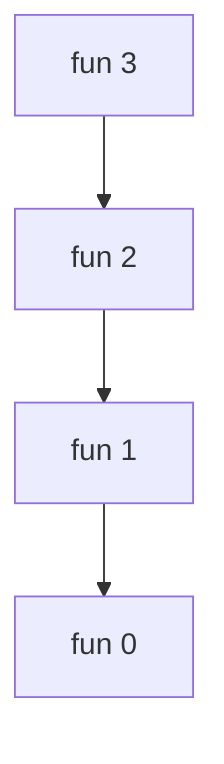
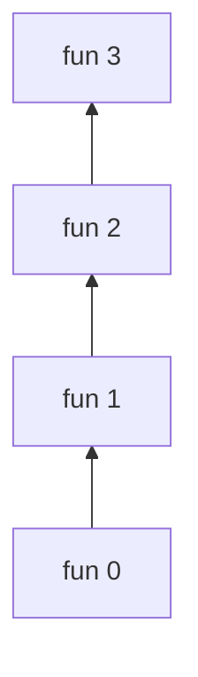
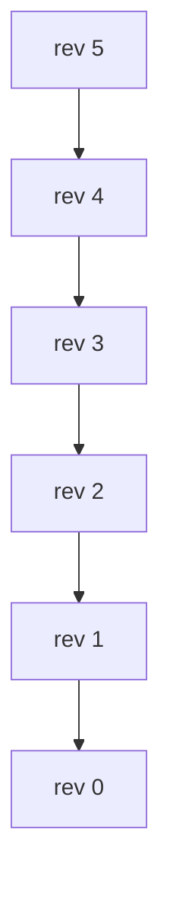
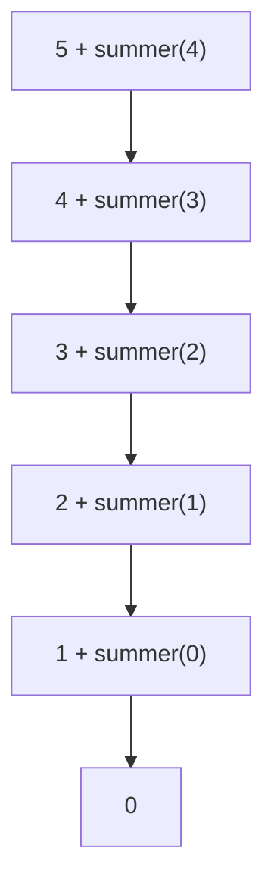
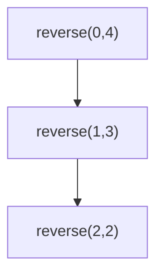

# 🔁 RECURSION

## 📖 Definition

**Recursion** is a technique where a function calls itself to solve a smaller version of the same problem.

Every recursive function must have:

### 1️⃣ Base Condition
The condition that stops recursion.

### 2️⃣ Recursive Call
The function calling itself with a smaller input.

```java
static void fun(int n){
    if(n == 0){     // Base Condition
        return;
    }

    fun(n - 1);     // Recursive Call
}
```

---

## 🧠 Golden Rule

```text
Recursion = Base Condition + Smaller Subproblem
```

Without a base condition:

```java
fun(n-1);
```

the function will keep calling itself forever and eventually cause:

```text
StackOverflowError
```

---

# 📦 Understanding the Call Stack

Example:

```java
static void fun(int n){
    if(n == 0){
        return;
    }

    System.out.println(n);
    fun(n-1);
}

fun(3);
```

### Output

```text
3
2
1
```

---

## Stack Visualization

### Function Calls



---

### Stack Growth



Think:

```text
fun(3)
 └─ fun(2)
      └─ fun(1)
           └─ fun(0)
```

Then returns:

```text
fun(0)
 ↑
fun(1)
 ↑
fun(2)
 ↑
fun(3)
```

---

# 🚀 Basic Programs

---

## 1️⃣ Print Numbers from N to 1

```java
static void rev(int n){
    if(n == 0){
        return;
    }

    System.out.println(n);

    rev(n - 1);
}
```

### Call Flow



### Output

```text
5
4
3
2
1
```

---

## 2️⃣ Print Stars

```java
static void printStars(int n){
    if(n == 0){
        return;
    }

    System.out.println("*");

    printStars(n - 1);
}
```

### Output

```text
*
*
*
*
*
```

---

## 3️⃣ Sum of First N Numbers

```java
static int summer(int n){
    if(n == 0){
        return 0;
    }

    return n + summer(n - 1);
}
```

### Example

```java
summer(5)
```

---

## Call Tree



---

## Returning Phase

```text
summer(0) = 0

summer(1) = 1 + 0 = 1

summer(2) = 2 + 1 = 3

summer(3) = 3 + 3 = 6

summer(4) = 4 + 6 = 10

summer(5) = 5 + 10 = 15
```

### Output

```text
15
```

---

# 🔄 Reverse Array Using Recursion

```java
static int[] reverser(int[] arr, int left, int right){

    if(left >= right){
        return arr;
    }

    int temp = arr[left];
    arr[left] = arr[right];
    arr[right] = temp;

    return reverser(arr, left + 1, right - 1);
}
```

---

## Example

```java
int[] arr = {1,2,3,4,5};
```

---

## Step 1

```text
1 2 3 4 5
↑       ↑
L       R
```

Swap:

```text
5 2 3 4 1
```

---

## Step 2

```text
5 2 3 4 1
  ↑   ↑
  L   R
```

Swap:

```text
5 4 3 2 1
```

---

## Step 3

```text
5 4 3 2 1
    ↑
```

Base Condition:

```java
left >= right
```

Stop.

---

## Recursive Flow



---

## Output

```text
5
4
3
2
1
```

---

# 🎯 Most Important Recursion Pattern

```java
static returnType function(parameters){

    // Base Condition
    if(condition){
        return value;
    }

    // Work

    // Recursive Call
    return function(smallerProblem);
}
```

---

# ⚡ Dry Run Template

Whenever solving recursion:

### Step 1

Write:

```text
Base Condition?
```

### Step 2

Write:

```text
What smaller problem am I solving?
```

### Step 3

Write:

```text
What should happen after recursion returns?
```

---

# 🏆 Last-Minute Revision Sheet

### Recursion Formula

```text
Base Condition
      +
Recursive Call
```

---

### Stack Behavior

```text
Calls go DOWN

Returns come UP
```

```text
fun(5)
 ↓
fun(4)
 ↓
fun(3)
 ↓
fun(2)
 ↓
fun(1)
 ↓
fun(0)

Then

fun(0)
 ↑
fun(1)
 ↑
fun(2)
 ↑
fun(3)
 ↑
fun(4)
 ↑
fun(5)
```

---

### Common Base Conditions

```java
if(n == 0)
if(n == 1)
if(left >= right)
if(index == arr.length)
if(node == null)
```

---

### Most Asked Recursion Problems

- Print 1 to N
- Print N to 1
- Sum of N numbers
- Factorial
- Fibonacci
- Reverse Array
- Palindrome Check
- Binary Search
- Subsequences
- Backtracking

---

## 🚨 Interview Tip

Whenever you get stuck in recursion:

**Draw the call stack first, not the code.**

The stack almost always reveals the solution.